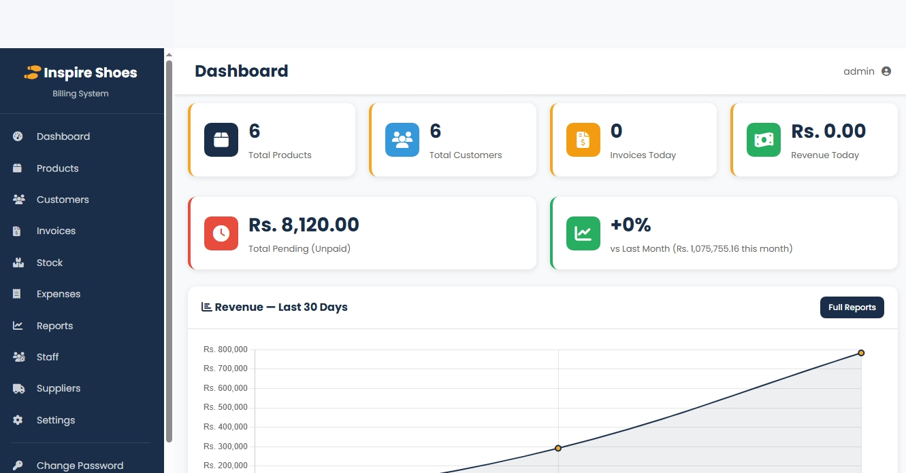
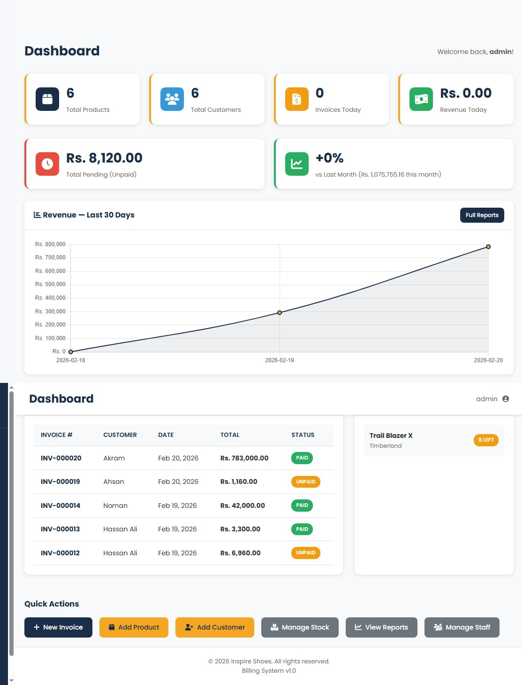
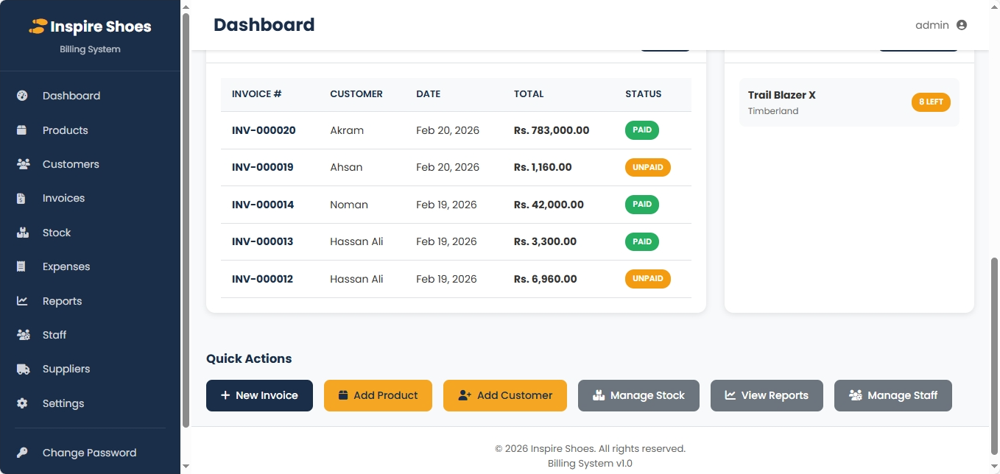
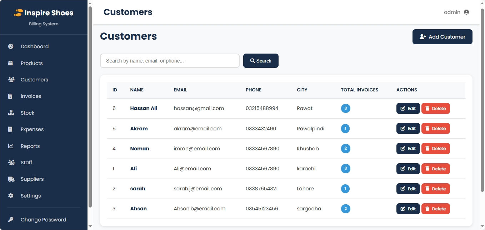
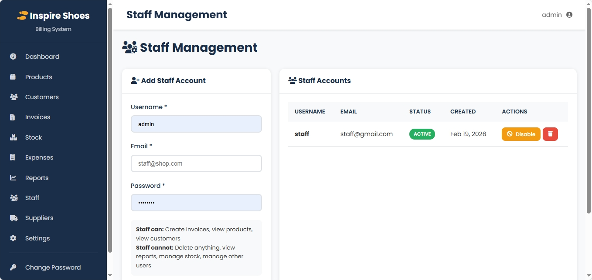
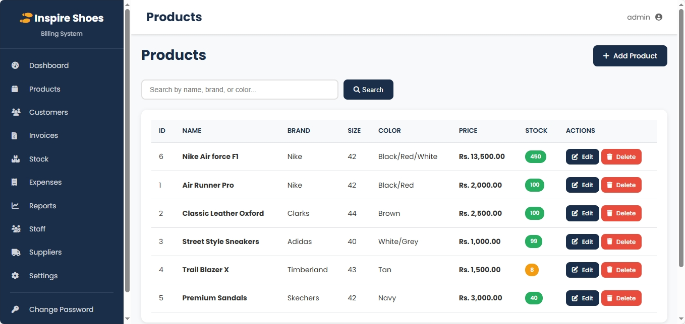
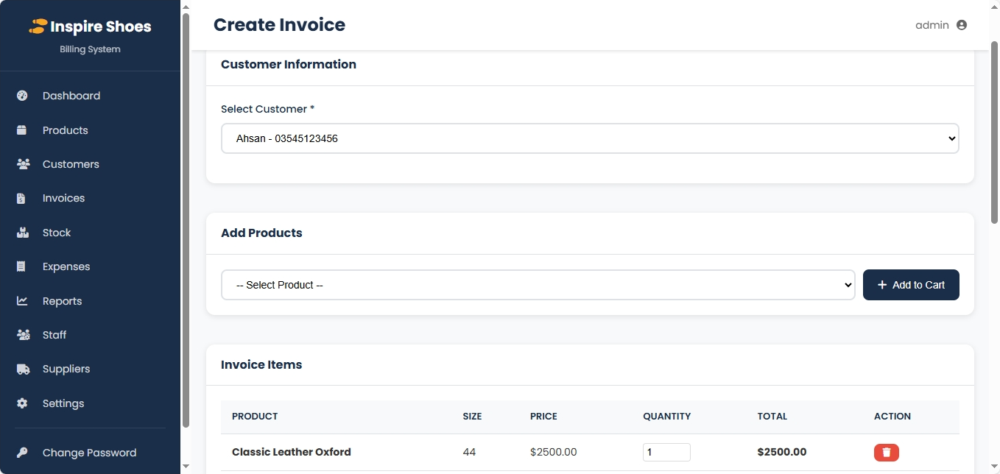
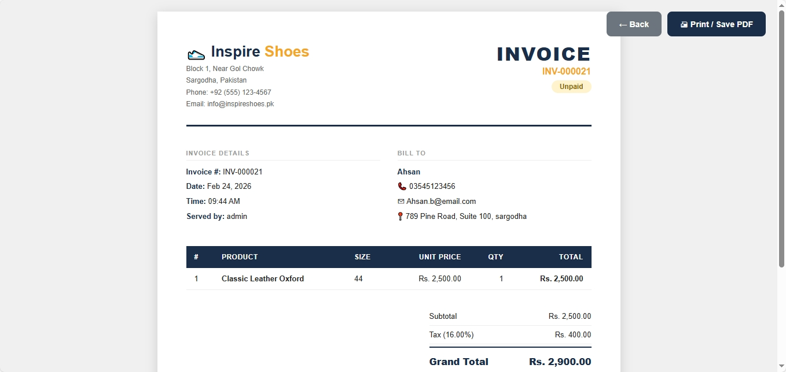
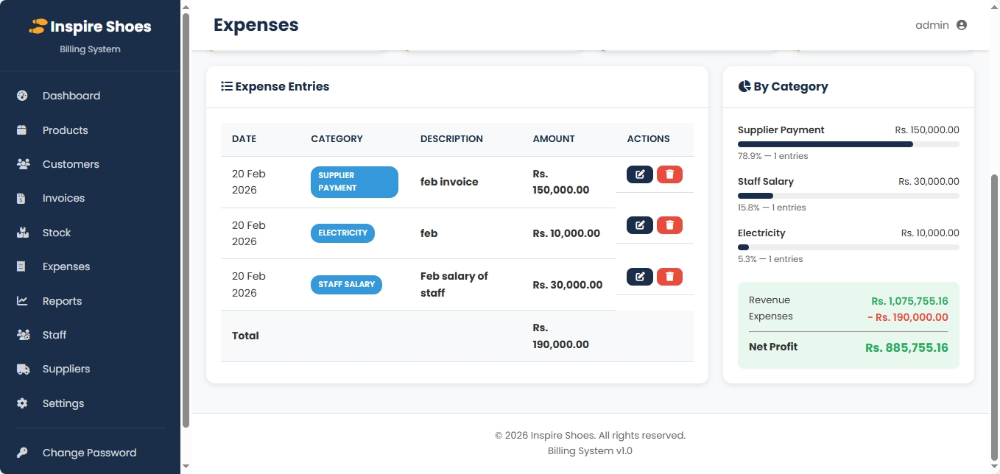

# Smart Billing & Inventory Management System

A complete web-based application to manage sales, inventory, customers, suppliers, expenses, and invoices efficiently. Built with PHP, MySQL, and JavaScript.

---

## Features

- User Authentication (Login, Register, Change Password)
- Dashboard with key metrics
- Customer Management
- Supplier Management
- Product & Stock Management
- Invoice creation and management
- Expense tracking
- Sales reporting

---

## Screenshots

### Login Page


### Dashboard




### Customers



### Products & Stock



### Suppliers


### Invoices


.png)


### Expenses



### Sales Report

---

## Installation

1. Clone the repository:```bash
git clone https://github.com/Samhey-0/Smart_Billing_Inventory_Management_System.git
2. Place the project in your XAMPP htdocs folder.

3. Create a MySQL database and import database/inspire_shoes.sql.

4. Update config/db.php with your database credentials.

5. Open your browser and go to http://localhost/Smart_Billing_Inventory_Management_System.

```bash
git clone https://github.com/Samhey-0/Smart_Billing_Inventory_Management_System.git
